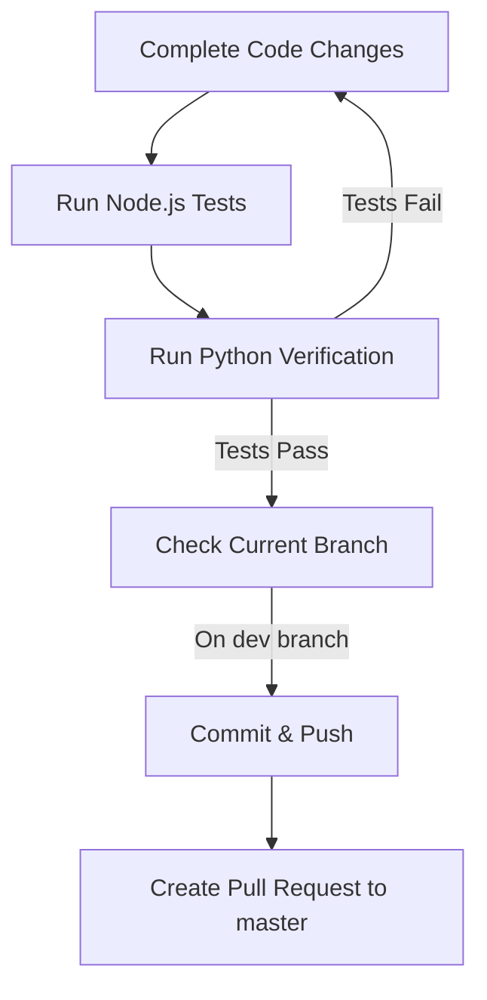

# Git Workflow & Task Completion Guide

This document details the mandatory workflow to execute upon completing any task in the Canvas LMS Agent workspace. All agents must follow this workflow to ensure code quality and adhere to branch protection policies.

## Workflow Overview



---

## 1. Run Unit & Verification Tests
Before committing any changes, you must ensure that all tests pass. Never commit broken code.

### Node.js Unit Tests
Run the Jest/Node unit tests under `canvas-lms-mcp`:
```bash
npm --prefix canvas-lms-mcp test
```
All tests must pass. If any test fails, fix the code and re-run.

### Python Verification Tests
Run the Python integration and verification script inside the virtual environment:
```bash
.venv/bin/python canvas-lms-mcp/verify_mcp.py
```
This tests real tool interactions with the Canvas API (using mock/sandbox credentials defined in `.env`). Ensure it completes with `PASS` status.

---

## 2. Document and Persist Learnings (AGENTS.md)
Before committing, evaluate whether this task yielded reusable patterns, API usage gotchas, technical guidelines, or process optimizations that should apply to future tasks.

### Enforce Progressive Disclosure
When persisting rules to [AGENTS.md](file:///home/likr/src/likr-sandbox/canvas-lms-agent/.agents/AGENTS.md), you must keep the main rules file clean, concise, and scannable:

1. **High-Level Bullet in AGENTS.md**: Add only a brief description of the rule under the relevant header in `AGENTS.md`.
2. **Detailed Document in references/**: Place code snippets, exhaustive command options, error logs, and detailed descriptions in a new Markdown file within `.agents/references/` (e.g., `.agents/references/new_guideline.md`).
3. **Link**: Insert a clickable link in `AGENTS.md` pointing to the new detail file using absolute path notation (e.g., `[new_guideline.md](file:///home/likr/src/likr-sandbox/canvas-lms-agent/.agents/references/new_guideline.md)`).

---

## 3. Prepare and Commit Changes
Verify that you are on the `dev` branch. Direct commits to `master` are prohibited.

### Check Status
Ensure all modified files (including `AGENTS.md` and any newly added reference files in `.agents/references/`) are tracked.
```bash
git status
```

### Commit Changes
Use clean, descriptive commit messages outlining what was changed and why:
```bash
git add .
git commit -m "feat(mcp): implement new API endpoint and update rules"
```

---

## 4. Push and Create Pull Request
Once committed, push your changes to the remote repository and create a Pull Request to merge `dev` into `master`.

### Push Changes
```bash
git push origin dev
```

### Create Pull Request
Use the `github-mcp-server` tool `create_pull_request` (or the `gh` CLI if available) to create a Pull Request.

**PR Parameters:**
- **Repository**: `likr-sandbox/canvas-lms-agent`
- **Base**: `master` (protected branch)
- **Head**: `dev`
- **Title**: Describe the feature or fix (e.g., `Merge dev into master: Implement task completion workflow`)
- **Body**: Summarize:
  1. Key changes made
  2. Verification status (JUnit/verification test results)
  3. Any manual verification performed

After creating the PR, do not attempt to merge it directly. Report the PR link to the user and conclude your task.
