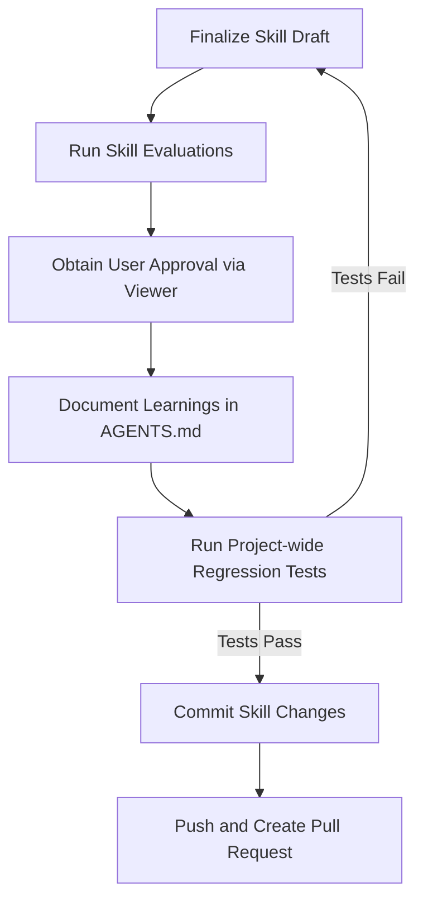

# Skill-Creator Task Completion & Git Workflow

This document details the specific workflow required when finalizing the creation or modification of a skill using the `skill-creator` system. You must follow these steps before considering your skill creation task complete.

## Workflow Overview



---

## 1. Skill-Specific Evaluation
Before proposing your skill changes for merge, you must execute the evaluation harness defined in the [Skill Creator Guide](file:///home/likr/src/likr-sandbox/canvas-lms-agent/.agents/skills/skill-creator/SKILL.md).

1. **Run Eval Tests**:
   Ensure all evaluation cases specified in `evals/evals.json` are executed.
2. **Grade Outcomes**:
   Grade the results (using the automated grading scripts or `agents/grader.md` guidelines) and record the outcomes in `grading.json`.
3. **Launch Reviewer**:
   Start the evaluation viewer to present outcomes to the user:
   ```bash
   nohup python <skill-creator-path>/eval-viewer/generate_review.py \
     <workspace>/iteration-N \
     --skill-name "my-skill" \
     --benchmark <workspace>/iteration-N/benchmark.json \
     --static <output_path> \
     > /dev/null 2>&1 &
   ```
4. **Obtain Validation**:
   Review the user's `feedback.json`. The user must be satisfied with the quality of the skill output before proceeding.

---

## 2. Document Learnings in AGENTS.md
During skill creation/modification, you may uncover reusable patterns, rules, tool behaviors, or constraints that should apply broadly to the workspace.

### Enforce Progressive Disclosure
When updating [AGENTS.md](file:///home/likr/src/likr-sandbox/canvas-lms-agent/.agents/AGENTS.md):
1. **Keep AGENTS.md Clean**: Only add a concise, high-level summary of the rule or pattern.
2. **Delegate Details**: Write code snippets, setup instructions, and complex guidelines in a dedicated Markdown file inside the respective skill's `references/` directory (or `.agents/references/`).
3. **Link**: Provide a direct link in `AGENTS.md` to that reference file using absolute path notation (e.g., `[my-rule.md](file:///home/likr/src/likr-sandbox/canvas-lms-agent/.agents/skills/my-skill/references/my-rule.md)`).

---

## 3. Project-Wide Regression Testing
To ensure the new or updated skill does not introduce regressions to the rest of the workspace:

1. **Run Node.js MCP Tests**:
   ```bash
   npm --prefix canvas-lms-mcp test
   ```
2. **Run Python Integration Tests**:
   ```bash
   .venv/bin/python canvas-lms-mcp/verify_mcp.py
   ```
   Both test suites must pass 100%.

---

## 4. Commit and PR Creation

### Commit Changes
Stage and commit the newly created skill directory, test suites, updated `AGENTS.md`, new reference files, and any updated configurations. Keep your commits clean:
```bash
git add .agents/skills/<your-skill-name>
git add .agents/AGENTS.md
# Stage any newly created reference files as well
git commit -m "feat(skill): implement <your-skill-name> skill and record learnings"
```

### Pull Request
1. **Push**:
   ```bash
   git push origin dev
   ```
2. **Create PR**:
   Use the `github-mcp-server` tool `create_pull_request` to create a PR from `dev` to `master`.
   - **Title**: `feat(skill): introduce <your-skill-name> skill`
   - **Body**: Include:
     - Purpose of the skill
     - Evaluation metrics (pass rate, speed/token benchmarks)
     - Brief summary of learnings added to `AGENTS.md`
     - Results of the regression tests
